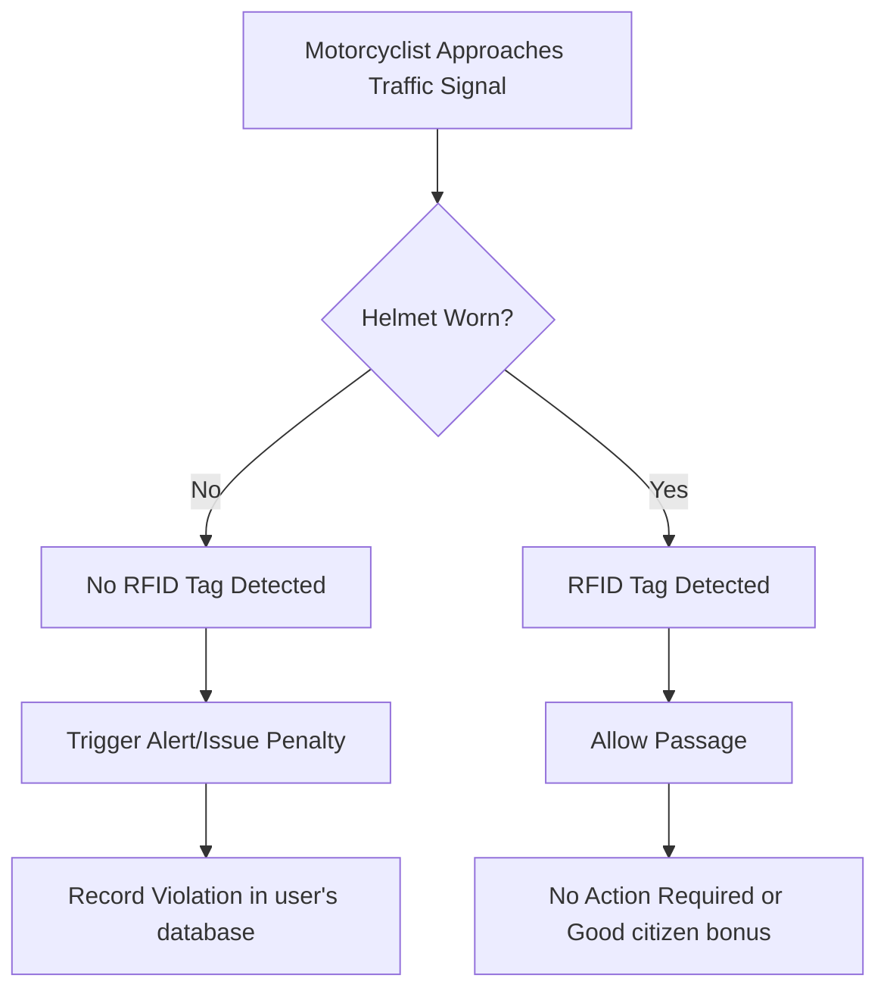

```mermaid
flowchart TD
    A[Motorcyclist Approaches Traffic Signal] --> B{Helmet Worn?}
    
    B -- No --> C[No RFID Tag Detected]
    C --> D[Trigger Alert/Issue Penalty]
    
    B -- Yes --> E[RFID Tag Detected]
    E --> F[Allow Passage]
    
    D --> G[Record Violation in user's database]
    F --> H[No Action Required or Good citizen bonus]

```
